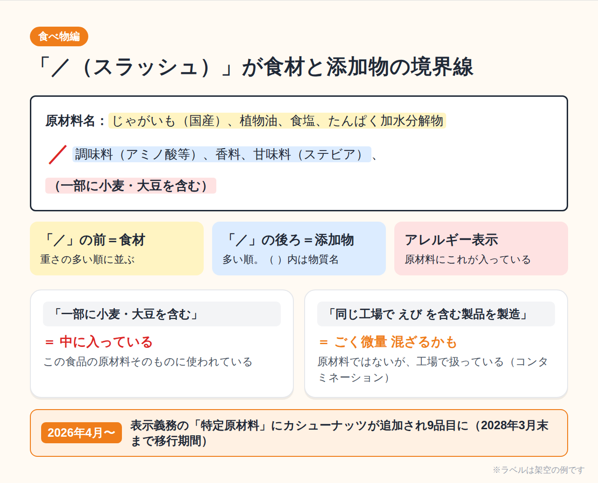

# 【スマホ1台で謎解き】商品ラベルの「呪文みたいな成分」をGeminiに読ませたら、毎日の買い物が変わった話

## この記事でわかる3つのこと

- 食べ物・洗剤・化粧品・サプリの裏ラベルを「**成分**」と「**注意書き**」に分けて読むコツ
- スマホで**撮って → Geminiに聞くだけ**の具体的な手順（コピペ用の指示文つき）
- AIの答えを**うのみにしない**ための、たった1つの確認ステップ

## 用意するもの

- スマホ1台
- 無料のGeminiアプリ（またはブラウザ版Gemini）
- 家にある商品を1つ（お菓子でも洗剤でもOK）

専門知識はいりません。読み終わるころには、裏ラベルが「ただの文字の壁」から「メーカーからの手紙」に見えてきます。

---

## 1. ラベル、ちゃんと読めていますか？

スーパーでお菓子を手に取り、何気なく裏返す。

「乳化剤、香料、調味料（アミノ酸等）……」

うん、わからない。そっと棚に戻すか、気にせずカゴに入れるか。たいていの人はこのどちらかだと思います。私もそうでした。

でも、裏ラベルは本来**私たちを守るために法律やルールで書かせている情報**です。読めないまま捨てるのは、取扱説明書を開かずに家電を使うようなもの。

そこで今回の「Geminiとやってみた」企画です。お題は、

> **商品ラベル・成分表示にフォーカスして、意味を知る！**

食べ物・洗剤・化粧品・サプリの4つを、Geminiに「**何の成分か**」と「**注意書きは何を言っているのか**」に分けて説明してもらいました。

---

## 2. やり方は3ステップだけ


### ステップ1：撮る

裏ラベルの「原材料名（成分）」と「注意書き」が**1枚に収まるように**撮ります。うまく撮るコツは3つ。

- 明るい場所で、**真上から**撮る（斜めだと文字が歪みます）
- 光の反射が入ったら、少し角度を変える
- 文字が小さければ、成分欄と注意書きを**2枚に分けて**撮る

### ステップ2：Geminiに送って聞く

Geminiアプリを開き、入力欄の「＋」から写真を選んで、次の文章を一緒に送ります。

```
この写真は商品の裏ラベルです。
文字を読み取ったうえで、中学生にもわかる言葉で次の3つを教えてください。
①主な成分は何で、それぞれ何のために入っているか
②注意書きは何を言っていて、守らないと何が起こるか
③この商品で特に気をつける人（アレルギー、子ども、持病のある人など）
最後に、写真から読み取れなかった文字があれば正直に教えてください。
```

最後の1行がポイントです。AIは読めなかった文字を「それっぽく」埋めてしまうことがあるので、**「読めなかったら言って」と先にお願いしておく**と事故が減ります。

### ステップ3：確かめる

Geminiの答えに出てきた成分名を、**実物のラベルと1つずつ見比べてください。**写真の読み間違いは意外と起こります。特にアレルギーや薬の飲み合わせは、AIの答えだけで判断せず、必ずラベル本体・メーカー・医師や薬剤師に確認しましょう。

ここからは、実際に4ジャンルでやってみた結果です。（今回は架空の商品ラベルで解説しています。Geminiの回答は要点を整理したもので、実際の文面は毎回少し変わります）

---

## 3. 食べ物編：「／（スラッシュ）」が境界線



### 成分の意味

試したのは、こんなスナック菓子のラベルです。

```
原材料名：じゃがいも（国産）、植物油、食塩、たんぱく加水分解物
／調味料（アミノ酸等）、香料、甘味料（ステビア）、（一部に小麦・大豆を含む）
```

Geminiがまず教えてくれたのは、**「／」より前が食材、後ろが食品添加物**というルールでした。どちらも、重さの多い順に並んでいます。

添加物の役割は、Geminiの言葉を借りるとこんな感じです。

- **調味料（アミノ酸等）**：うま味を足す。昆布だしの「うま味成分」の仲間
- **香料**：香りを足す・整える
- **甘味料（ステビア）**：少ない量で甘くする。カッコの中が具体的な物質名
- **保存料・酸化防止剤**：腐りにくく、味が落ちにくくする

「添加物＝悪者」と思いがちですが、Geminiの答えは「**国が使える量を決めて認めたもので、それぞれ役割がある**」という冷静なものでした。気になるなら「何のために入っているか」で判断すればいい、という視点は新鮮でした。

### 注意書きの解読

いちばん大事なのは**アレルギー表示**です。

- 「（一部に小麦・大豆を含む）」は、**この食品の原材料そのものに**小麦と大豆が入っている、という意味
- 別に書かれる「本品製造工場では、えびを含む製品を生産しています」は、**同じ工場で扱っているので、ごく微量混ざる可能性がある**（コンタミネーション）という注意

この2つは意味が違います。ここ、Geminiに確認するまで私は混同していました。

さらに最新情報として、**2026年4月からカシューナッツが表示義務のある「特定原材料」に加わり、9品目**になりました（えび・かに・くるみ・小麦・そば・卵・乳・落花生・カシューナッツ）。ただし2028年3月末までは移行期間なので、古い表示の商品もまだ店頭に並びます。ナッツアレルギーのある人は、しばらく特に慎重に。

「開封後はお早めに」も聞いてみました。答えは「空気と湿気でしけたり油が酸化したりするので、袋を閉じて数日以内が目安。ただし**メーカーの表示や、におい・見た目の変化を優先して**」。AIは目安は出せても、あなたの家の保存状態までは見えていない、という正直な答えでした。

---

## 4. 洗剤編：「まぜるな危険」は本当に危険


### 成分の意味

洗剤のラベルには、たとえばこう書いてあります。

```
液性：アルカリ性
成分：次亜塩素酸ナトリウム（塩素系）、水酸化ナトリウム、界面活性剤（アルキルアミンオキシド）
```

**界面活性剤**をGeminiに聞くと、「水と油は本来混ざらない。その間に入って手をつながせ、汚れを水に溶かして流せるようにする**仲人**のような成分」という説明。わかりやすい。

そしてもう1つ大事なのが**液性**です。汚れには相性があります。

- **油汚れ・皮脂・タンパク汚れ（酸性の汚れ）** → アルカリ性の洗剤が得意
- **水あか・石けんカス・尿石（アルカリ性の汚れ）** → 酸性の洗剤が得意
- **普段のちょっとした汚れ** → 中性洗剤（素材にやさしい）

「汚れと反対の性質の洗剤をぶつける」と覚えると、もう洗剤選びで迷いません。

### 注意書きの解読

**「まぜるな危険 塩素系」**。これは法律で表示が義務づけられている、とても重い注意書きです。

塩素系（カビ取り剤・漂白剤など）と酸性タイプ（トイレ用洗剤の一部、クエン酸、お酢など）が混ざると、**有毒な塩素ガス**が発生します。Geminiは「目やのど、肺を傷つけ、狭い浴室では命に関わる」と強い言葉で警告してくれました。

覚え方は簡単です。

- **同じ日に塩素系と酸性系を続けて使わない**（使うなら十分に水で流してから）
- **換気扇を回し、窓を開ける**
- ゴム手袋とメガネで目と手を守る

「用途外に使用しない」も、「素材を傷める（金属のサビ、大理石の変色など）」「すすぎ残しが肌に触れる」ためでした。

---

## 5. 化粧品編：いちばん多いのは、たいてい「水」


### 成分の意味

化粧水の裏には、こんな「全成分」が並んでいます。

```
水、BG、グリセリン、ペンチレングリコール、ヒアルロン酸Na、
セラミドNP、クエン酸Na、フェノキシエタノール
```

Geminiが教えてくれたルールは2つ。

1. **配合量の多い順に書かれている**（だから先頭はたいてい「水」）
2. ただし**配合量1%以下の成分は順不同**でOK

つまり、宣伝で目立つ「ヒアルロン酸」や「セラミド」が後ろのほうにあるのは普通のこと。前のほう（水・BG・グリセリン）が**土台（ベース）**、真ん中から後ろに**うるおい成分**、最後のほうに**品質を守る成分**、という並びです。

- **BG・グリセリン**：うるおいを抱え込む保湿剤
- **ヒアルロン酸Na・セラミドNP**：肌の水分を保つサポート役
- **フェノキシエタノール**：防腐剤。開け閉めのたびに入る雑菌から中身を守る

「防腐剤なし」をうたう商品もありますが、Geminiは「防腐剤がない分、開封後の使用期限が短いこともある」と、良し悪しの両面を説明してくれました。

なお、「薬用」と書かれた**医薬部外品**は、効果のある「有効成分」が別枠で書かれるなど、ルールが少し違います。

### 注意書きの解読

「お肌に異常が生じていないかよく注意して使用してください」。どの化粧品にも書いてある定番の一文です。

Geminiに「異常って具体的に何？」と聞くと、

- **赤み・かゆみ・はれ・ぶつぶつ**が出た
- 使ったあと**日光に当たって**同じような症状が出た
- 肌に**白い斑点（白斑）**など色の変化が出た

ときは使用をやめ、皮膚科へ。その際は**商品を持っていくと診察がスムーズ**、という実用的なアドバイスまでくれました。

「高温多湿・直射日光を避けて」は、熱や光で成分が分離・変質したり、雑菌が増えたりするのを防ぐため。**夏の車内や、日の当たる窓辺はNG**です。

---

## 6. サプリ編：飲めば飲むほど効く、わけではない


### 成分の意味

マルチビタミンの原材料欄を読ませてみると、意外な事実がわかります。

```
原材料名：還元麦芽糖水飴、デキストリン／ビタミンC、結晶セルロース、
ステアリン酸Ca、ビタミンE、ナイアシン、ビタミンA、ビタミンD、…
```

先頭にあるのは、ビタミンではなく**還元麦芽糖水飴やデキストリン**。Geminiいわく「粒の形を作るための土台や、飲みやすくするための成分」。結晶セルロースは**粒を固める**、ステアリン酸Caは**機械にくっつかないようにする**役目です。

ビタミンそのものはほんの少量でも十分働くので、粒の大部分が「形を作るための成分」なのは普通のことなのだそうです。

### 注意書きの解読

「多量摂取により疾病が治癒したり、より健康が増進するものではありません」。

これは「たくさん飲んでも意味がない」どころか、**飲みすぎが逆効果になることもある**という警告です。特に**ビタミンA・D・E・K（脂溶性ビタミン）**は、水に溶けにくく体にたまりやすいため、とりすぎに注意が必要です。

そしてもう1つ。

> 「薬を服用中あるいは通院中の方は医師、薬剤師にご相談ください」

Geminiが例に挙げたのは、血液をサラサラにする薬（ワルファリン）とビタミンKの組み合わせ。ビタミンKが**薬の効き目を弱めてしまう**ことがあります。サプリは食品でも、薬と「けんか」をすることがあるわけです。

ちなみに、2024年の紅麹サプリ問題をきっかけに、**機能性表示食品**のルールが厳しくなりました。健康被害の情報を保健所へ報告することが義務になり、2026年9月からは、錠剤・カプセル型の機能性表示食品に**GMP（製造工程の品質管理の基準）**も義務化されています。ラベルの「機能性表示食品」「栄養機能食品」の文字は、こうしたルールの下で作られた目印です。

---

## 7. まとめ：ラベルは「メーカーからの手紙」、Geminiは「通訳」


4ジャンルを読み解いてわかったのは、どの裏ラベルも

- **成分欄**＝「この商品は何でできているか」
- **注意書き**＝「こう使わないと危ないよ」

の2つでできている、ということでした。そして、それぞれに読み方のルールがあります。

| ジャンル | 成分欄で見るところ | 注意書きで見るところ |
|---|---|---|
| 食べ物 | 「／」の前は食材、後ろは添加物 | アレルギー表示と工場の注意 |
| 洗剤 | 液性と界面活性剤 | 「まぜるな危険」 |
| 化粧品 | 多い順。1%以下は順不同 | 肌の異常が出たら中止 |
| サプリ | 先頭は「形を作る成分」が多い | 飲みすぎ・薬との飲み合わせ |

Geminiは、この「呪文」を一瞬で日本語に訳してくれる頼もしい**通訳**です。ただし最終的な判断をするのは、あなた自身。特にアレルギーと薬のことは、**ラベル本体と専門家で必ず確認**してください。

### ちょっとした裏ワザ

毎回プロンプトを打つのが面倒な人は、Geminiの「**Gem（ジェム）**」機能に、ステップ2の文章を登録しておくのがおすすめです。次からは写真を送るだけで、同じ形式で解説してくれる「ラベル翻訳係」が完成します。

---

## 今日の宿題

今すぐ、手元のペットボトルでも、ハンドソープでも構いません。裏ラベルを1枚パシャっと撮って、Geminiに聞いてみてください。

「え、これってそういう意味だったの？」が、きっと1つは見つかります。

見つけた発見は、ぜひコメントで教えてください。この企画「Geminiとやってみた」、次回もお楽しみに！

---

※本記事は一般的な情報提供を目的としたもので、医療上の診断や特定の商品の安全性を保証するものではありません。体調やアレルギー、服薬に関する判断は、必ず医師・薬剤師などの専門家にご相談ください。表示ルールは2026年10月時点の情報です。

#Gemini #AI活用 #やってみた #食品表示 #成分表示 #生活の知恵
