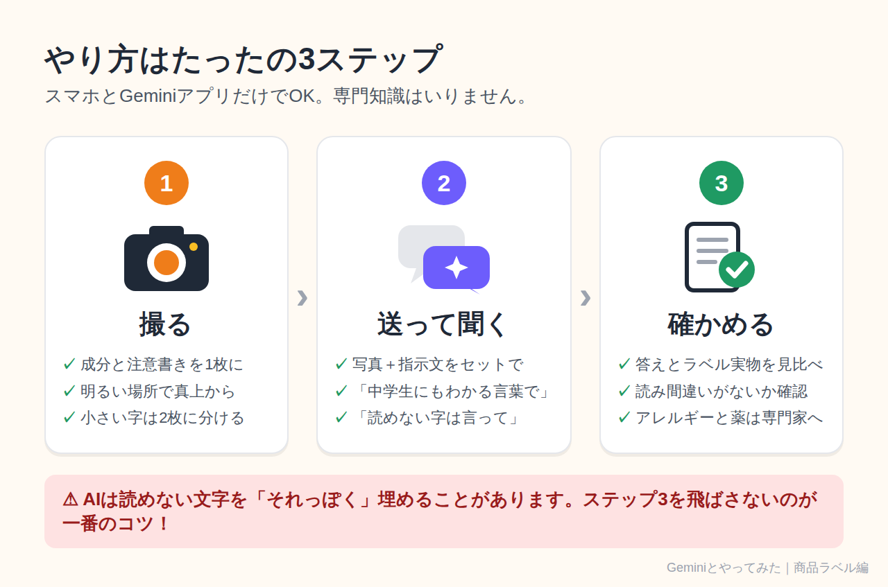
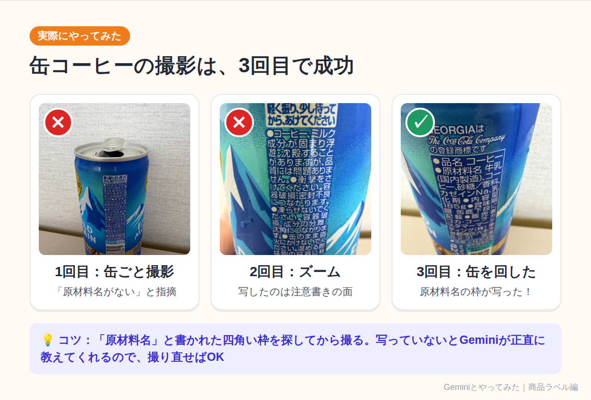
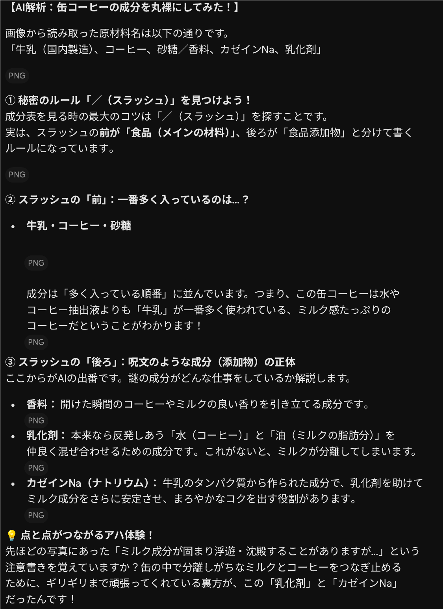
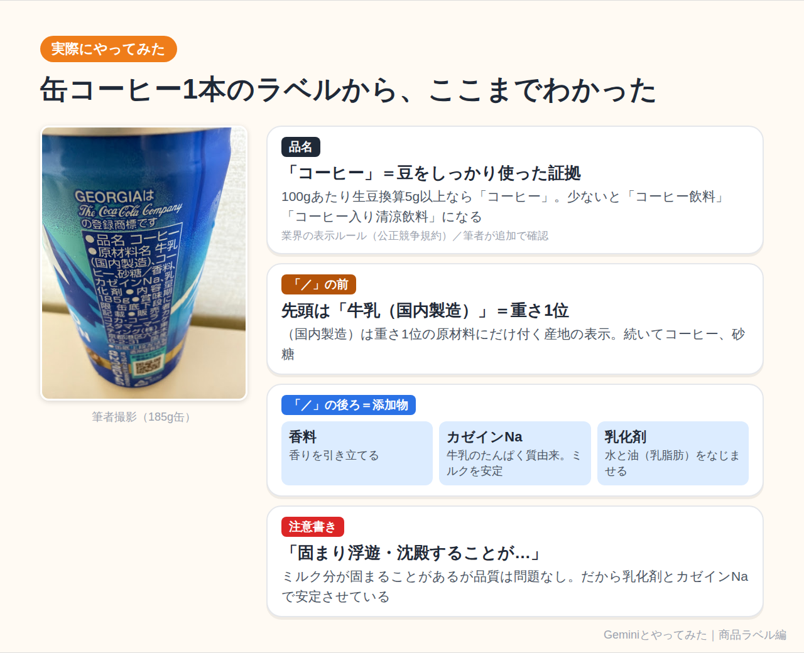
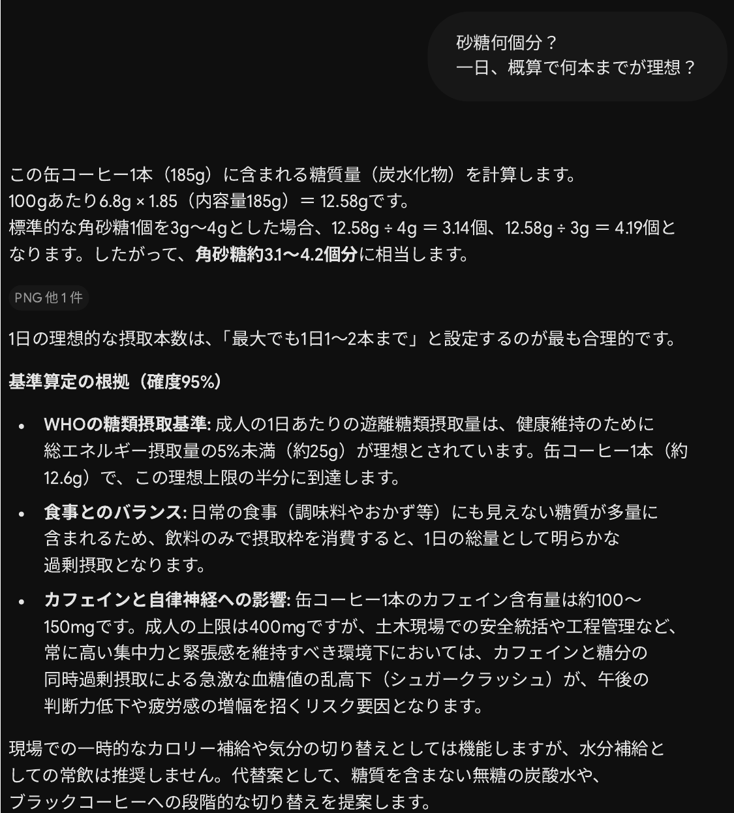
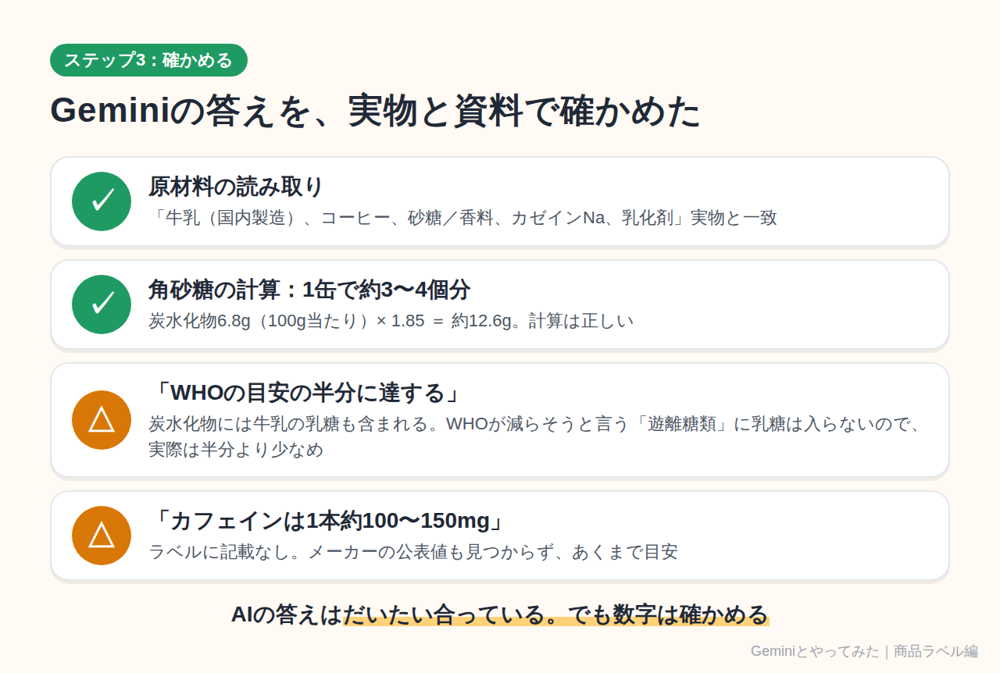
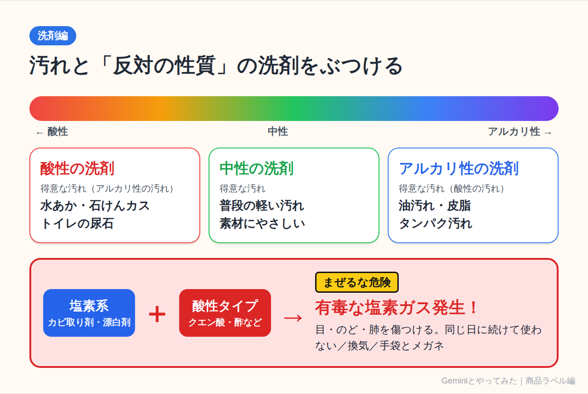
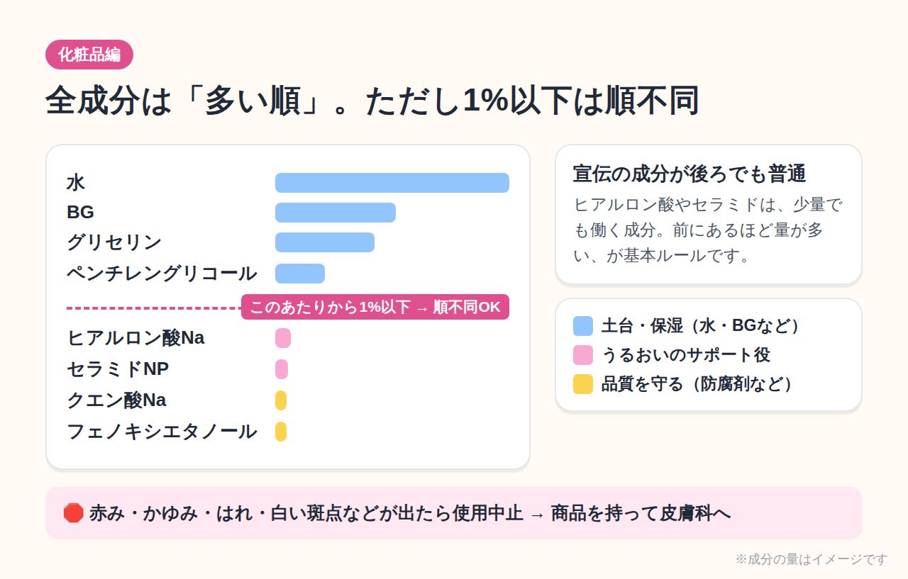
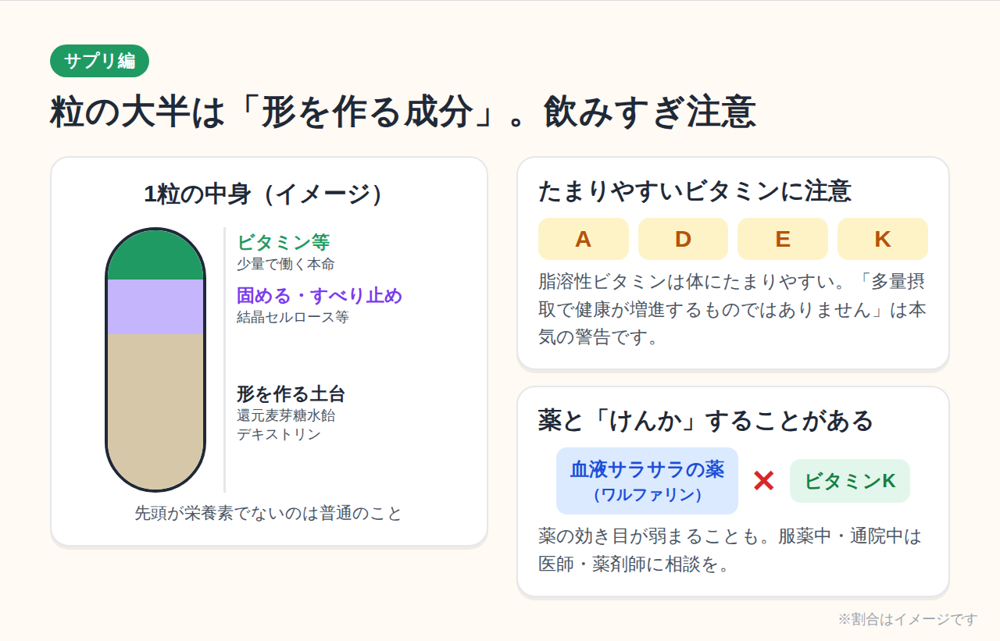
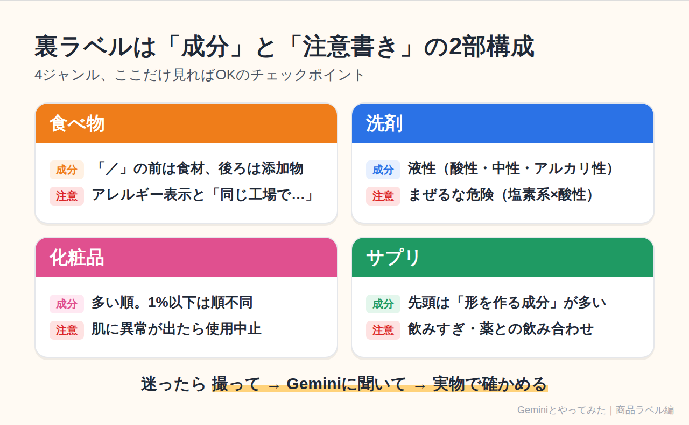

# 【スマホ1台で謎解き】商品ラベルの「呪文みたいな成分」をGeminiに読ませたら、毎日の買い物が変わった話

## この記事でわかる3つのこと

- 食べ物・洗剤・化粧品・サプリの裏ラベルを「**成分**」と「**注意書き**」に分けて読むコツ
- スマホで**撮って → Geminiに聞くだけ**の具体的な手順（缶コーヒーで実演、コピペ用の指示文つき）
- AIの答えを**うのみにしない**ための、たった1つの確認ステップ

## 用意するもの

- スマホ1台
- 無料のGeminiアプリ（またはブラウザ版Gemini）
- 家にある商品を1つ（お菓子でも洗剤でもOK）

専門知識はいりません。読み終わるころには、裏ラベルが「ただの文字の壁」から「メーカーからの手紙」に見えてきます。

---

## 1. ラベル、ちゃんと読めていますか？

缶コーヒーを手に取り、何気なく裏返す。「カゼインNa、乳化剤……」うん、わからない。たいていの人はそのままカゴに入れると思います。私もそうでした。

でも、裏ラベルは本来**私たちを守るために法律やルールで書かせている情報**です。読めないまま捨てるのは、取扱説明書を開かずに家電を使うようなもの。

そこで今回の「Geminiとやってみた」企画です。お題は、

> **商品ラベル・成分表示にフォーカスして、意味を知る！**

食べ物・洗剤・化粧品・サプリの4つを、Geminiに「**何の成分か**」と「**注意書きは何を言っているのか**」に分けて説明してもらいました。

---

## 2. やり方は3ステップだけ



### ステップ1：撮る

裏ラベルの「原材料名（成分）」と「注意書き」が**1枚に収まるように**撮ります。うまく撮るコツは3つ。

- 明るい場所で、**真上から**撮る（斜めだと文字が歪みます）
- 光の反射が入ったら、少し角度を変える
- 文字が小さければ、成分欄と注意書きを**2枚に分けて**撮る

### ステップ2：Geminiに送って聞く

Geminiアプリを開き、入力欄の「＋」から写真を選んで、次の文章を一緒に送ります。

```
この写真は商品の裏ラベルです。
文字を読み取ったうえで、中学生にもわかる言葉で次の3つを教えてください。
①主な成分は何で、それぞれ何のために入っているか
②注意書きは何を言っていて、守らないと何が起こるか
③この商品で特に気をつける人（アレルギー、子ども、持病のある人など）
最後に、写真から読み取れなかった文字があれば正直に教えてください。
```

最後の1行がポイントです。AIは読めなかった文字を「それっぽく」埋めてしまうことがあるので、**「読めなかったら言って」と先にお願いしておく**と事故が減ります。

### ステップ3：確かめる

Geminiの答えに出てきた成分名を、**実物のラベルと1つずつ見比べてください。**写真の読み間違いは意外と起こります。特にアレルギーや薬の飲み合わせは、AIの答えだけで判断せず、必ずラベル本体・メーカー・医師や薬剤師に確認しましょう。

ここからは、4ジャンルでやってみた結果です。食べ物編は、手元の缶コーヒーで**本当にGeminiとやりとりした記録**です。洗剤・化粧品・サプリは、よくあるラベルを例にした解説です（Geminiの答えは毎回少しずつ言い回しが変わります）。

---

## 3. 食べ物編：缶コーヒー1本で本当にやってみた

### 撮影は3回目で成功

いきなり失敗から始まりました。



1回目は缶全体を撮って「この缶コーヒーの成分調べて！」と送信。するとGeminiは、

> 残念ながら、いただいた写真の角度では「成分表示（原材料名）」のリストが写っていません。

と、**写っていないものは写っていないと正直に**返してきました。それでも写っていた注意書きだけは先に解説してくれる、気の利いた返事です。

2回目はズームしたものの、写したのはまた注意書きの面。3回目に缶をくるっと回して、ようやく「原材料名」の四角い枠が写りました。

**撮るときは「原材料名」の枠を探してから。**これが一番の学びです。

### 成分の意味：「／（スラッシュ）」が境界線

3回目の写真から、Geminiが読み取った原材料名がこちら。

```
原材料名：牛乳（国内製造）、コーヒー、砂糖／香料、カゼインNa、乳化剤
```



Geminiがまず教えてくれたのは、**「／」より前が食材、後ろが食品添加物**というルール。そして、どちらも**重さの多い順**に並んでいます。つまりこの缶コーヒーは、いちばん多い材料が「牛乳」。ミルク感たっぷりの1本だとわかります。

「／」の後ろの添加物は、Geminiの解説を要約するとこうです。

- **香料**：開けた瞬間のコーヒーやミルクの香りを引き立てる
- **乳化剤**：本来は反発しあう「水（コーヒー）」と「油（ミルクの脂肪）」を仲良く混ぜる
- **カゼインNa**：牛乳のたんぱく質から作られた成分。ミルクをさらに安定させ、コクを出す

### 注意書きの解読：成分と注意書きが「つながった」

缶には「コーヒー、ミルク成分が固まり浮遊・沈殿することがありますが、品質には問題ありません」という注意書きがありました。

Geminiはここで、こうまとめてくれました。**分離しがちなミルクとコーヒーをつなぎ止めているのが、乳化剤とカゼインNa**。成分欄と注意書きが1本の線でつながる、ちょっとした「アハ体験」でした。

ほかの注意書きも、理由を聞くと納得です。

- **「凍らせないでください」**：凍ると体積が増えて缶が壊れるうえ、ミルクが分離して元の味に戻らない
- **「缶のまま直火にかけないでください」**：密閉された缶が熱で破裂するおそれがある



ちなみに、Geminiが触れなかった発見も1つ。ラベルの**「品名：コーヒー」**には意味があります。業界の表示ルールで、100gあたり生豆換算5g以上のコーヒー豆を使ったものだけが「コーヒー」と名乗れます。少ないと「コーヒー飲料」「コーヒー入り清涼飲料」です。缶を買うとき、品名を見比べると面白いですよ。

### 角砂糖何個分？ 1日何本まで？ も聞いてみた

正面の栄養成分表示も撮って、「砂糖何個分？ 一日、概算で何本までが理想？」と聞いてみました。



答えは、**1缶（185g）で炭水化物約12.6g、角砂糖およそ3〜4個分**。1日の目安は「**最大でも1〜2本まで**」でした。私の仕事（現場での安全管理）まで踏まえて、「集中力が必要な午後の判断力低下につながる」と注意してくれたのには驚きました。

### ステップ3：答えを確かめてみた

ここで終わらないのが今回の企画です。Geminiの答えを、実物のラベルと公的な資料で確かめました。



- **原材料の読み取り** → 実物と一致。正確でした
- **角砂糖の計算** → 6.8g × 1.85 ＝ 約12.6g。正しい
- **「WHOの目安（1日約25g）の半分に達する」** → ここは少し注意。栄養成分表示の「炭水化物」には**牛乳にもともと含まれる乳糖**も入っています。WHOが「減らそう」と言っている**遊離糖類（砂糖など、あとから加えた糖）には乳糖は含まれない**ので、実際は半分より少なめです
- **「カフェインは1本約100〜150mg」** → ラベルに記載がなく、メーカーの公表値も見つけられませんでした。あくまで目安として受け取るのが正解です

AIの答えは、だいたい合っています。でも**数字だけは確かめる**。これが実際にやってみて一番実感したことです。

### アレルギー表示も要チェック

この缶では、先頭の「牛乳」と、牛乳のたんぱく質からできた「カゼインNa」のどちらも**乳**に由来します。乳アレルギーの人は要注意です。

アレルギー表示には、意味の違う2種類があります。

- 「（一部に小麦・大豆を含む）」→ **原材料そのものに**入っている
- 「本品製造工場では、えびを含む製品を生産しています」→ **同じ工場で扱っているので、ごく微量混ざる可能性がある**（コンタミネーション）

さらに、**2026年4月からカシューナッツが表示義務のある「特定原材料」に加わり、9品目**になりました（えび・かに・くるみ・小麦・そば・卵・乳・落花生・カシューナッツ）。2028年3月末までは移行期間なので、古い表示の商品もまだ店頭に並びます。ナッツアレルギーのある人は、しばらく特に慎重に。

---

## 4. 洗剤編：「まぜるな危険」は本当に危険



### 成分の意味

洗剤のラベルには、たとえばこう書いてあります。

```
液性：アルカリ性
成分：次亜塩素酸ナトリウム（塩素系）、水酸化ナトリウム、界面活性剤（アルキルアミンオキシド）
```

**界面活性剤**をGeminiに聞くと、「水と油は本来混ざらない。その間に入って手をつながせ、汚れを水に溶かして流せるようにする**仲人**のような成分」という説明。わかりやすい。

そしてもう1つ大事なのが**液性**です。汚れには相性があります。

- **油汚れ・皮脂・タンパク汚れ（酸性の汚れ）** → アルカリ性の洗剤が得意
- **水あか・石けんカス・尿石（アルカリ性の汚れ）** → 酸性の洗剤が得意
- **普段のちょっとした汚れ** → 中性洗剤（素材にやさしい）

「汚れと反対の性質の洗剤をぶつける」と覚えると、もう洗剤選びで迷いません。

### 注意書きの解読

**「まぜるな危険 塩素系」**。これは法律で表示が義務づけられている、とても重い注意書きです。

塩素系（カビ取り剤・漂白剤など）と酸性タイプ（トイレ用洗剤の一部、クエン酸、お酢など）が混ざると、**有毒な塩素ガス**が発生します。Geminiは「目やのど、肺を傷つけ、狭い浴室では命に関わる」と強い言葉で警告してくれました。

覚え方は簡単です。

- **同じ日に塩素系と酸性系を続けて使わない**（使うなら十分に水で流してから）
- **換気扇を回し、窓を開ける**
- ゴム手袋とメガネで目と手を守る

---

## 5. 化粧品編：いちばん多いのは、たいてい「水」



### 成分の意味

化粧水の裏には、こんな「全成分」が並んでいます。

```
水、BG、グリセリン、ペンチレングリコール、ヒアルロン酸Na、
セラミドNP、クエン酸Na、フェノキシエタノール
```

Geminiが教えてくれたルールは2つ。

1. **配合量の多い順に書かれている**（だから先頭はたいてい「水」）
2. ただし**配合量1%以下の成分は順不同**でOK

つまり、宣伝で目立つ「ヒアルロン酸」や「セラミド」が後ろのほうにあるのは普通のこと。前のほう（水・BG・グリセリン）が**土台（ベース）**、真ん中から後ろに**うるおい成分**、最後のほうに**品質を守る成分**、という並びです。

- **BG・グリセリン**：うるおいを抱え込む保湿剤
- **ヒアルロン酸Na・セラミドNP**：肌の水分を保つサポート役
- **フェノキシエタノール**：防腐剤。開け閉めのたびに入る雑菌から中身を守る

### 注意書きの解読

「お肌に異常が生じていないかよく注意して使用してください」。どの化粧品にも書いてある定番の一文です。

Geminiに「異常って具体的に何？」と聞くと、

- **赤み・かゆみ・はれ・ぶつぶつ**が出た
- 使ったあと**日光に当たって**同じような症状が出た
- 肌に**白い斑点（白斑）**など色の変化が出た

ときは使用をやめ、皮膚科へ。その際は**商品を持っていくと診察がスムーズ**、という実用的なアドバイスまでくれました。

「高温多湿・直射日光を避けて」は、熱や光で成分が分離・変質したり、雑菌が増えたりするのを防ぐため。**夏の車内や、日の当たる窓辺はNG**です。

---

## 6. サプリ編：飲めば飲むほど効く、わけではない



### 成分の意味

マルチビタミンの原材料欄を読ませてみると、意外な事実がわかります。

```
原材料名：還元麦芽糖水飴、デキストリン／ビタミンC、結晶セルロース、
ステアリン酸Ca、ビタミンE、ナイアシン、ビタミンA、ビタミンD、…
```

先頭にあるのは、ビタミンではなく**還元麦芽糖水飴やデキストリン**。Geminiいわく「粒の形を作るための土台や、飲みやすくするための成分」。結晶セルロースは**粒を固める**、ステアリン酸Caは**機械にくっつかないようにする**役目です。

### 注意書きの解読

「多量摂取により疾病が治癒したり、より健康が増進するものではありません」。

これは「たくさん飲んでも意味がない」どころか、**飲みすぎが逆効果になることもある**という警告です。特に**ビタミンA・D・E・K（脂溶性ビタミン）**は、水に溶けにくく体にたまりやすいため、とりすぎに注意が必要です。

そしてもう1つ。

> 「薬を服用中あるいは通院中の方は医師、薬剤師にご相談ください」

Geminiが例に挙げたのは、血液をサラサラにする薬（ワルファリン）とビタミンKの組み合わせ。ビタミンKが**薬の効き目を弱めてしまう**ことがあります。サプリは食品でも、薬と「けんか」をすることがあるわけです。

ちなみに、2024年の紅麹サプリ問題をきっかけに**機能性表示食品**のルールが厳しくなり、2026年9月からは錠剤・カプセル型の製品に**GMP（製造工程の品質管理の基準）**も義務化されています。

---

## 7. まとめ：ラベルは「メーカーからの手紙」、Geminiは「通訳」



4ジャンルを読み解いてわかったのは、どの裏ラベルも

- **成分欄**＝「この商品は何でできているか」
- **注意書き**＝「こう使わないと危ないよ」

の2つでできている、ということでした。そして、それぞれに読み方のルールがあります（上の図がチェックポイントのまとめです）。

Geminiは、この「呪文」を一瞬で日本語に訳してくれる頼もしい**通訳**です。ただし最終的な判断をするのは、あなた自身。特にアレルギーと薬のことは、**ラベル本体と専門家で必ず確認**してください。

### ちょっとした裏ワザ

毎回プロンプトを打つのが面倒な人は、Geminiの「**Gem（ジェム）**」機能に、ステップ2の文章を登録しておくのがおすすめです。次からは写真を送るだけで、同じ形式で解説してくれる「ラベル翻訳係」が完成します。

---

## 今日の宿題

今すぐ、手元のペットボトルでも、ハンドソープでも構いません。裏ラベルを1枚パシャっと撮って、Geminiに聞いてみてください。

「え、これってそういう意味だったの？」が、きっと1つは見つかります。

見つけた発見は、ぜひコメントで教えてください。この企画「Geminiとやってみた」、次回もお楽しみに！

---

※本記事は一般的な情報提供を目的としたもので、医療上の診断や特定の商品の安全性を保証するものではありません。体調やアレルギー、服薬に関する判断は、必ず医師・薬剤師などの専門家にご相談ください。表示ルールは2026年10月時点の情報です。

#Gemini #AI活用 #やってみた #食品表示 #成分表示 #生活の知恵
